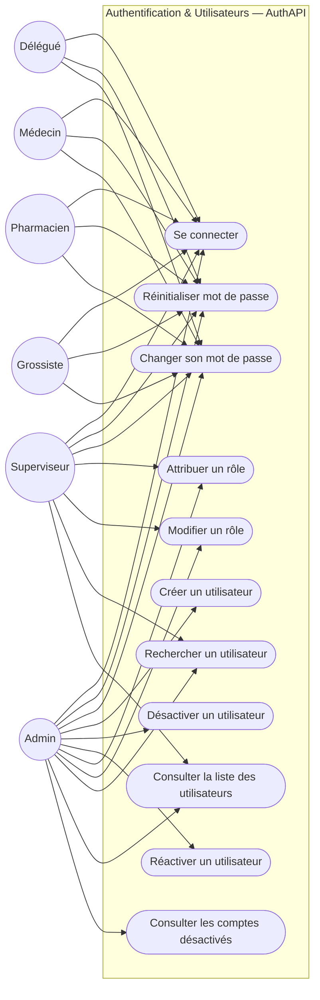
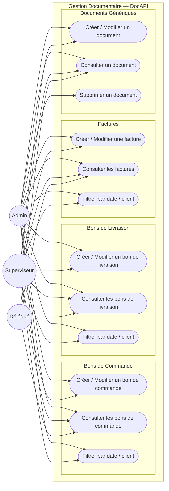
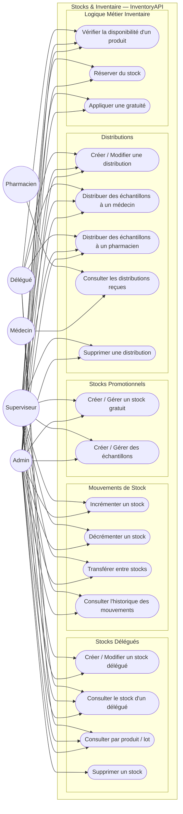

# Diagramme de Cas d'Utilisation — CynapSoft CRM

> **Périmètre** : Backend microservices (.NET) — 6 services métier + API Gateway  
> **Acteurs** : Admin · Superviseur · Délégué · Médecin · Pharmacien · Grossiste

---

## 1. Acteurs et Périmètres

| Acteur | Type | Description |
|--------|------|-------------|
| **Admin** | Interne | Administrateur système — accès total |
| **Superviseur** | Interne | Responsable terrain — pilotage des délégués et validation |
| **Délégué** | Interne | Représentant médical — visites, rapports, distributions |
| **Médecin** | Client | Reçoit des visites, échantillons et distributions |
| **Pharmacien** | Client | Passe des commandes, reçoit des livraisons |
| **Grossiste** | Client | Passe des commandes en gros, reçoit des livraisons |

---

## 2. Diagramme Global — Vue d'ensemble

```mermaid
flowchart TD
    Admin((Admin))
    Sup((Superviseur))
    Del((Délégué))
    Med((Médecin))
    Pha((Pharmacien))
    Gro((Grossiste))

    subgraph SYS["🏢 CynapSoft CRM — Système"]

        subgraph AUTH["🔐 Authentification & Utilisateurs"]
            A1([Se connecter])
            A2([Réinitialiser mot de passe])
            A3([Changer mot de passe])
            A4([Gérer les utilisateurs])
            A5([Attribuer / Modifier un rôle])
            A6([Rechercher un utilisateur])
        end

        subgraph FIELD["📋 Gestion Terrain — Visites"]
            F1([Créer un planning de visite])
            F2([Valider un planning])
            F3([Effectuer une visite])
            F4([Rédiger un rapport de visite])
            F5([Valider un rapport de visite])
            F6([Définir des objectifs délégué])
            F7([Consulter KPIs & performances])
            F8([Gérer les régions])
        end

        subgraph DOC["📄 Gestion Documentaire"]
            D1([Créer un bon de commande])
            D2([Créer un bon de livraison])
            D3([Créer une facture])
            D4([Consulter les documents])
        end

        subgraph INV["📦 Stocks & Inventaire"]
            I1([Gérer les stocks délégués])
            I2([Effectuer des mouvements de stock])
            I3([Distribuer des échantillons])
            I4([Appliquer des gratuités])
            I5([Vérifier la disponibilité stock])
            I6([Recevoir une distribution])
        end

        subgraph ORDER["🛒 Commandes & Réclamations"]
            O1([Passer une commande])
            O2([Gérer les lignes de commande])
            O3([Consulter les commandes])
            O4([Valider / Mettre à jour le statut])
            O5([Déposer une réclamation])
            O6([Traiter une réclamation])
        end

        subgraph PROD["💊 Produits, Lots & Promotions"]
            P1([Créer / Modifier un produit])
            P2([Archiver / Désarchiver un produit])
            P3([Gérer les lots])
            P4([Créer / Gérer des promotions])
            P5([Gérer les supports marketing])
            P6([Consulter le catalogue produits])
            P7([Consulter les promotions actives])
        end

    end

    %% --- Admin ---
    Admin --> A1 & A2 & A3 & A4 & A5 & A6
    Admin --> F1 & F2 & F4 & F5 & F6 & F7 & F8
    Admin --> D1 & D2 & D3 & D4
    Admin --> I1 & I2 & I3 & I4 & I5
    Admin --> O3 & O4 & O6
    Admin --> P1 & P2 & P3 & P4 & P5 & P6 & P7

    %% --- Superviseur ---
    Sup --> A1 & A2 & A3 & A5 & A6
    Sup --> F1 & F2 & F4 & F5 & F6 & F7 & F8
    Sup --> D1 & D2 & D3 & D4
    Sup --> I1 & I2 & I3 & I4 & I5
    Sup --> O3 & O4 & O6
    Sup --> P1 & P3 & P4 & P5 & P6 & P7

    %% --- Délégué ---
    Del --> A1 & A2 & A3
    Del --> F1 & F3 & F4 & F8
    Del --> D4
    Del --> I1 & I3 & I5
    Del --> O3
    Del --> P6 & P7

    %% --- Médecin ---
    Med --> A1 & A2 & A3
    Med --> I6

    %% --- Pharmacien ---
    Pha --> A1 & A2 & A3
    Pha --> O1 & O2 & O5
    Pha --> I6
    Pha --> P6 & P7

    %% --- Grossiste ---
    Gro --> A1 & A2 & A3
    Gro --> O1 & O2 & O5
    Gro --> P6 & P7
```



---

## 3. Détail par Domaine

### 3.1 🔐 Authentification & Gestion des Utilisateurs



---

### 3.2 📋 Gestion Terrain — Visites, Planning, Objectifs & KPIs

```mermaid
flowchart LR
    Admin((Admin))
    Sup((Superviseur))
    Del((Délégué))

    subgraph FIELD["Gestion Terrain — FieldAPI"]

        subgraph VIS["Visites"]
            F1([Créer / Mettre à jour une visite])
            F2([Consulter une visite])
            F3([Clôturer une visite])
            F4([Supprimer une visite])
        end

        subgraph PLAN["Planning"]
            F5([Créer un planning de visite])
            F6([Valider un planning])
            F7([Affecter une visite à un planning])
            F8([Consulter le planning])
            F9([Supprimer un planning])
        end

        subgraph RAPP["Rapports de Visite"]
            F10([Rédiger un rapport de visite])
            F11([Valider et clôturer un rapport])
            F12([Supprimer un rapport])
            F13([Vérifier si un rapport existe])
        end

        subgraph OBJ["Objectifs"]
            F14([Définir un objectif pour un délégué])
            F15([Mettre à jour la valeur d'un objectif])
            F16([Consulter les objectifs])
            F17([Supprimer un objectif])
        end

        subgraph KPI["KPIs & Performances"]
            F18([Compter les visites réalisées])
            F19([Analyser les performances d'un délégué])
            F20([Calculer le taux de fidélité client])
            F21([Consulter l'historique d'activité])
        end

        subgraph REG["Régions"]
            F22([Créer / Gérer une région])
            F23([Consulter les régions d'un délégué])
            F24([Supprimer une région])
        end
    end

    Admin --> F1 & F2 & F4 & F5 & F6 & F8 & F9
    Admin --> F10 & F11 & F12 & F13
    Admin --> F14 & F15 & F16 & F17
    Admin --> F18 & F19 & F20 & F21
    Admin --> F22 & F23 & F24

    Sup --> F1 & F2 & F4 & F5 & F6 & F8 & F9
    Sup --> F10 & F11 & F12 & F13
    Sup --> F14 & F15 & F16
    Sup --> F18 & F19 & F20 & F21
    Sup --> F22 & F23

    Del --> F1 & F2 & F3 & F5 & F7 & F8
    Del --> F10 & F12 & F13
    Del --> F16
    Del --> F23
```



---

### 3.3 📄 Gestion Documentaire



---

### 3.4 📦 Stocks & Inventaire



---

### 3.5 🛒 Commandes & Réclamations

```mermaid
flowchart LR
    Admin((Admin))
    Sup((Superviseur))
    Del((Délégué))
    Pha((Pharmacien))
    Gro((Grossiste))

    subgraph ORDER["Commandes & Réclamations — OrderAPI"]

        subgraph CMD["Commandes"]
            O1([Passer une commande])
            O2([Ajouter / Modifier une ligne de commande])
            O3([Supprimer une ligne de commande])
            O4([Consulter les commandes])
            O5([Consulter les commandes d'un client])
            O6([Mettre à jour le statut d'une commande])
            O7([Supprimer une commande])
        end

        subgraph REC["Réclamations"])
            O8([Déposer une réclamation])
            O9([Consulter les réclamations])
            O10([Mettre à jour le statut d'une réclamation])
            O11([Supprimer une réclamation])
        end
    end

    Admin --> O4 & O5 & O6 & O7
    Admin --> O9 & O10 & O11

    Sup --> O4 & O5 & O6
    Sup --> O9 & O10

    Del --> O4 & O5
    Del --> O9

    Pha --> O1 & O2 & O3 & O5 & O6
    Pha --> O8

    Gro --> O1 & O2 & O3 & O5 & O6
    Gro --> O8
```

> **États d'une commande** : `Brouillon → En Attente → Validée → Expédiée → Livrée / Annulée`  
> **États d'une réclamation** : `Ouverte → En Cours → Résolue`

---

### 3.6 💊 Produits, Lots, Promotions & Marketing

```mermaid
flowchart LR
    Admin((Admin))
    Sup((Superviseur))
    Del((Délégué))
    Med((Médecin))
    Pha((Pharmacien))
    Gro((Grossiste))

    subgraph PROD["Produits & Catalogue — ProductAPI"]

        subgraph CAT["Catalogue Produits"]
            P1([Créer / Modifier un produit])
            P2([Activer / Désactiver un produit])
            P3([Archiver / Désarchiver un produit])
            P4([Rechercher / Filtrer les produits])
            P5([Consulter le catalogue])
            P6([Consulter le tableau de bord produits])
            P7([Identifier les produits en rupture])
        end

        subgraph LOT["Gestion des Lots"]
            P8([Créer / Modifier un lot])
            P9([Mettre à jour la quantité d'un lot])
            P10([Vérifier l'expiration d'un lot])
            P11([Consulter les lots proches expiration])
            P12([Consulter les lots expirés])
            P13([Supprimer un lot])
        end

        subgraph PROMO["Promotions"]
            P14([Créer / Modifier une promotion])
            P15([Appliquer une promotion sur un prix])
            P16([Vérifier si un produit est en promo])
            P17([Consulter les promotions actives])
            P18([Supprimer une promotion])
        end

        subgraph MKT["Supports Marketing"]
            P19([Créer / Modifier un support marketing])
            P20([Ajouter un fichier à un support])
            P21([Activer / Désactiver un support])
            P22([Consulter les supports par produit])
            P23([Consulter les campagnes])
            P24([Supprimer un fichier marketing])
        end
    end

    Admin --> P1 & P2 & P3 & P4 & P5 & P6 & P7
    Admin --> P8 & P9 & P10 & P11 & P12 & P13
    Admin --> P14 & P15 & P16 & P17 & P18
    Admin --> P19 & P20 & P21 & P22 & P23 & P24

    Sup --> P1 & P2 & P4 & P5 & P6 & P7
    Sup --> P8 & P9 & P10 & P11 & P12
    Sup --> P14 & P15 & P16 & P17
    Sup --> P19 & P20 & P21 & P22 & P23

    Del --> P4 & P5
    Del --> P8 & P10 & P11
    Del --> P15 & P16 & P17
    Del --> P22 & P23

    Med --> P5 & P17
    Pha --> P5 & P17
    Gro --> P5 & P17
```



---

## 4. Récapitulatif des Cas d'Utilisation par Acteur

### Admin
| Domaine | Cas d'utilisation |
|---------|-------------------|
| Authentification | Se connecter, Gérer utilisateurs, Attribuer rôles, Désactiver/Réactiver comptes |
| Terrain | Créer plannings, Valider plannings et rapports, Définir objectifs, Consulter KPIs, Gérer régions |
| Documentaire | Créer et gérer bons de commande, livraison, factures et documents |
| Inventaire | Gérer stocks, mouvements, distributions, gratuités, échantillons |
| Commandes | Consulter et gérer commandes, traiter réclamations, mettre à jour statuts |
| Produits | Cycle de vie complet produit, lots, promotions, supports marketing |

### Superviseur
| Domaine | Cas d'utilisation |
|---------|-------------------|
| Authentification | Se connecter, Attribuer rôles, Rechercher utilisateurs |
| Terrain | Créer/valider plannings, valider rapports, définir objectifs, consulter KPIs |
| Documentaire | Créer et consulter tous les documents commerciaux |
| Inventaire | Gérer stocks, mouvements, distributions, échantillons |
| Commandes | Consulter commandes, valider statuts, traiter réclamations |
| Produits | Créer produits, gérer lots, promotions et supports marketing |

### Délégué
| Domaine | Cas d'utilisation |
|---------|-------------------|
| Authentification | Se connecter, Changer mot de passe |
| Terrain | Créer planning, effectuer visites, rédiger rapports, gérer régions |
| Documentaire | Consulter documents de ses clients |
| Inventaire | Consulter stocks, distribuer échantillons, vérifier disponibilité |
| Commandes | Consulter commandes de ses clients |
| Produits | Consulter catalogue, lots, promotions et supports marketing |

### Médecin
| Domaine | Cas d'utilisation |
|---------|-------------------|
| Authentification | Se connecter, Réinitialiser / Changer mot de passe |
| Inventaire | Recevoir des distributions (échantillons, gratuités) |
| Produits | Consulter le catalogue et les promotions |

### Pharmacien
| Domaine | Cas d'utilisation |
|---------|-------------------|
| Authentification | Se connecter, Réinitialiser / Changer mot de passe |
| Commandes | Passer des commandes, ajouter lignes, déposer réclamations |
| Inventaire | Recevoir des distributions (échantillons, gratuités) |
| Produits | Consulter le catalogue et les promotions |

### Grossiste
| Domaine | Cas d'utilisation |
|---------|-------------------|
| Authentification | Se connecter, Réinitialiser / Changer mot de passe |
| Commandes | Passer des commandes en gros, ajouter lignes, déposer réclamations |
| Produits | Consulter le catalogue et les promotions |

---

## 5. Workflows Clés

### 5.1 Cycle de Vie d'une Visite Médicale

```
Délégué          Superviseur
   │                   │
   ├─ Crée planning ───►
   │                   ├─ Valide le planning
   │◄──────────────────┤
   ├─ Effectue la visite (clôture)
   ├─ Rédige le rapport
   │──────────────────►
   │                   ├─ Valide le rapport → Visite fermée
```

### 5.2 Cycle de Vie d'une Commande Client

```
Pharmacien/Grossiste    Superviseur/Admin
         │                      │
         ├─ Crée commande (Brouillon)
         ├─ Ajoute lignes de commande
         ├─ Soumet la commande (En Attente)
         │                      │
         │                      ├─ Valide → Validée
         │                      ├─ Expédie → Expédiée
         │                      ├─ Livre → Livrée
         │─── Ou ───────────────►
         ├─ Dépose réclamation
         │                      ├─ Ouvre → En Cours → Résolue
```

### 5.3 Cycle de Distribution d'Échantillons

```
Admin/Superviseur                 Délégué                  Médecin/Pharmacien
        │                            │                              │
        ├─ Crée stock échantillons ──►
        │                            ├─ Vérifie disponibilité
        │                            ├─ Crée distribution ──────────►
        │                            │                              ├─ Reçoit la distribution
```

---

## 6. Matrice d'Accès Résumée

| Cas d'utilisation | Admin | Superviseur | Délégué | Médecin | Pharmacien | Grossiste |
|---|:---:|:---:|:---:|:---:|:---:|:---:|
| **Authentification** | ✅ | ✅ | ✅ | ✅ | ✅ | ✅ |
| Gérer les utilisateurs | ✅ | 🔸 | ❌ | ❌ | ❌ | ❌ |
| Valider plannings & rapports | ✅ | ✅ | ❌ | ❌ | ❌ | ❌ |
| Effectuer une visite | ✅ | ✅ | ✅ | ❌ | ❌ | ❌ |
| Rédiger un rapport | ✅ | ✅ | ✅ | ❌ | ❌ | ❌ |
| Consulter KPIs & performances | ✅ | ✅ | ❌ | ❌ | ❌ | ❌ |
| Définir des objectifs | ✅ | ✅ | ❌ | ❌ | ❌ | ❌ |
| Créer bons de commande/livraison/factures | ✅ | ✅ | ❌ | ❌ | ❌ | ❌ |
| Gérer les stocks | ✅ | ✅ | 🔸 | ❌ | ❌ | ❌ |
| Distribuer échantillons | ✅ | ✅ | ✅ | ❌ | ❌ | ❌ |
| Recevoir une distribution | ❌ | ❌ | ❌ | ✅ | ✅ | ❌ |
| **Passer une commande** | ❌ | ❌ | ❌ | ❌ | ✅ | ✅ |
| Traiter les réclamations | ✅ | ✅ | ❌ | ❌ | ❌ | ❌ |
| **Déposer une réclamation** | ❌ | ❌ | ❌ | ❌ | ✅ | ✅ |
| Gérer le catalogue produits | ✅ | ✅ | ❌ | ❌ | ❌ | ❌ |
| Consulter le catalogue | ✅ | ✅ | ✅ | ✅ | ✅ | ✅ |
| Gérer les promotions | ✅ | ✅ | ❌ | ❌ | ❌ | ❌ |
| Consulter les promotions | ✅ | ✅ | ✅ | ✅ | ✅ | ✅ |
| Gérer supports marketing | ✅ | ✅ | ❌ | ❌ | ❌ | ❌ |

> ✅ Accès complet · 🔸 Accès partiel · ❌ Pas d'accès
